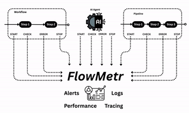
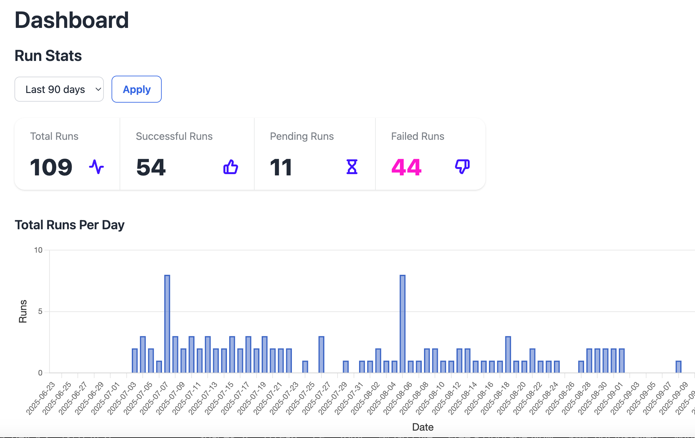

# FlowMetr
Workflow, Pipeline &amp; AI Agent Observability Platform. Metrics, logs and traces for all your automations.
Works with every tool, which is capable of sending a http request like:

[n8n](https://n8n.io), [make.com](https://make.com), [zapier](https://zapier.com), ...

Website: [FlowMetr](https://FlowMetr.com)

Newsletter: [FlowMetr Newsletter](https://flowmetr.beehiiv.com)



## Visualisations

FlowMetr visualises the status of all your workflows, project based or single workflows like this:



## Installation

```bash
SEED_DB=true docker compose up
```

## Usage

Login at http://localhost:3000 with the default credentials:

- Email: admin@example.com
- Password: password123

## Admin Panel

When using the default admin user the admin panel is accessable at http://localhost:3000/motor_admin

## Background job processing

FlowMetr uses Sidekiq for background job processing. When using the default admin user the sidekiq UI is available at http://localhost:3000/sidekiq

## Documentation

[FlowMetr Documentation](https://docs.flowmetr.com)


